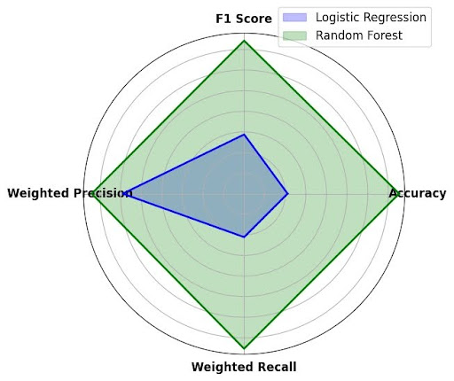
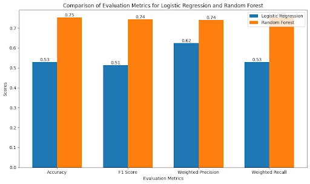

# 🏦 Consumer Complaint Prediction: Logistic Regression vs. Random Forest

This project compares the performance of **Logistic Regression** (linear model) and **Random Forest Classifier** (tree-based model) to predict consumer complaint outcomes. The dataset is sourced from the [Consumer Financial Protection Bureau (CFPB)](https://www.consumerfinance.gov/data-research/consumer-complaints/) and includes detailed complaint data. The analysis explores the impact of data preprocessing, feature selection, class imbalance, and feature scaling on model performance.

---

## 📋 Table of Contents
- [Project Overview](#project-overview)
- [Data Insights](#data-insights)
- [Preprocessing & Methodology](#preprocessing--methodology)
- [Model Evaluation](#model-evaluation)
- [Visualizations](#visualizations)
- [Conclusion](#conclusion)
- [How to Run the Code](#how-to-run-the-code)
- [Dependencies](#dependencies)

---

## 📜 Project Overview
Understanding and predicting consumer complaint outcomes is crucial for businesses and regulators. This project evaluates:
- The **effectiveness of feature selection** in handling high-dimensional data.
- The impact of **class imbalance solutions** on model fairness and accuracy.
- The role of **feature scaling** in ensuring models perform optimally.
- Comparative performance between **Logistic Regression** (linear) and **Random Forest Classifier** (non-linear).

---

## 📊 Data Insights
The data was sourced from the [CFPB Consumer Complaint Database](https://www.consumerfinance.gov/data-research/consumer-complaints/). Key features include:
- **Categorical:** Company Name, Product, Issue
- **Boolean:** Consumer Consent Provided, Consumer Disputed
- **Numerical:** Complaint ID (used for indexing)

Key statistics:
- Class imbalance was prominent, with outcomes like "Closed with Explanation" overrepresented.
- Non-linear relationships between variables indicated the need for tree-based models.

---

## 🛠 Preprocessing & Methodology
### **Preprocessing Steps**
1. **Encoding Techniques**:
   - **Binary Encoding**: Applied to boolean features like "Consumer Consent Provided."
   - **Frequency Encoding**: Used for high-cardinality categorical features like "Company Name."
   - **One-Hot Encoding**: Applied to unordered categorical features like "Submitted Via."
2. **Feature Selection**:
   - **LASSO Regularization**: Reduced dimensionality by penalizing less important features.
3. **Feature Scaling**:
   - Standardized numerical features to a uniform scale for consistency across models.
   - This ensured that features like "Complaint ID" or "Product Frequency" did not dominate model training due to larger magnitudes.
4. **Class Imbalance Handling**:
   - **Random Undersampling**: Balanced the dataset to ensure fair model evaluation.

### **Models Implemented**
1. **Logistic Regression**:
   - Baseline linear model.
   - Applied **Elastic Net Regularization** to balance bias and variance.
   - Benefited from feature scaling to improve gradient-based optimization.
2. **Random Forest Classifier**:
   - Tree-based ensemble model.
   - Handled non-linear relationships effectively without requiring feature scaling.

---

## 📈 Model Evaluation
### Metrics Used
1. **Accuracy**: Overall correctness of predictions.
2. **F1 Score**: Balance between precision and recall.
3. **ROC AUC**: Ability to distinguish between classes.
4. **Weighted Precision & Recall**: Accounts for class imbalance.

### Performance Highlights
| Metric                    | Logistic Regression | Random Forest |
|---------------------------|---------------------|---------------|
| **Accuracy**              | 0.24               | 0.52          |
| **F1 Score**              | 0.22               | 0.57          |
| **ROC AUC**               | 0.71               | 0.89          |
| **Weighted Precision**    | 0.57               | 0.71          |
| **Weighted Recall**       | 0.24               | 0.52          |

---

## 📊 Visualizations
To explore all visualizations, including:
1. **Confusion Matrices**: Compare model performance.
2. **Feature Importance Analysis**: Analyze the contribution of features to model performance.
3. **Grouped Bar Chart**: See metric-wise comparison between models.
4. **Spider Chart**: Holistic view of model performance metrics.

Access the full report: [**Consumer Complaint Prediction Analysis**](https://docs.google.com/document/d/1fhNJ6HpR4FvhLenCDKB26cYSfxljQU_RS_sj81zB2Lk/edit?usp=sharing)

**Findings**:

**Spider Chart**

<div align="center" style="background-color: #f7f7f7; padding: 20px; border-radius: 10px;">
    
    <h1 style="font-family: Arial, sans-serif; color: #333;">Samarth Singh</h1>
    <h3 style="color: #555;">Spider Chart</h3>
    <p style="font-size: 16px; color: #666;">Spider Chart</p>
</div>

**Grouped Bar Chart**

<div align="center" style="background-color: #f7f7f7; padding: 20px; border-radius: 10px;">
    
    <h1 style="font-family: Arial, sans-serif; color: #333;">Samarth Singh</h1>
    <h3 style="color: #555;">comparision_graph</h3>
    <p style="font-size: 16px; color: #666;">Comparision Grouped Bar Graph</p>
</div>
---

## 🧐 Conclusion
- **Random Forest Classifier** is better suited for this dataset, as it captures complex non-linear relationships that Logistic Regression struggles with.
- Addressing **class imbalance**, **feature selection**, and **scaling** were crucial for improving fairness and model interpretability.
- Random Forest consistently outperformed Logistic Regression across all key metrics.

---

## 💻 How to Run the Code
1. **Clone the repository**:
   ```bash
   git clone https://github.com/samarthsingh1/data_insights.git
